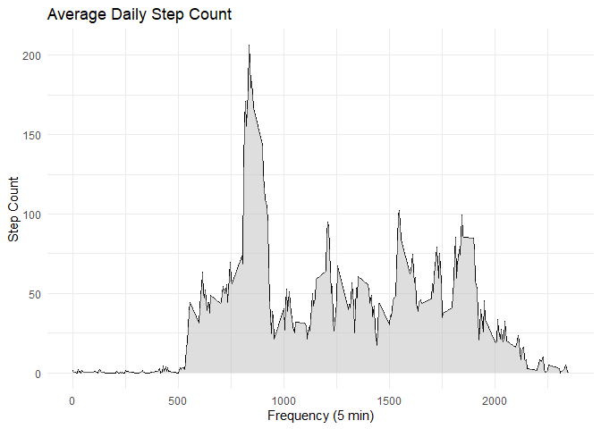

## Loading and preprocessing the data

I read the data and check its structure.

```r
df <- read.table("activity.csv", sep=",", header=TRUE)
head(df)
```

```
##   steps       date interval
## 1    NA 2012-10-01        0
## 2    NA 2012-10-01        5
## 3    NA 2012-10-01       10
## 4    NA 2012-10-01       15
## 5    NA 2012-10-01       20
## 6    NA 2012-10-01       25
```

```r
str(df)
```

```
## 'data.frame':	17568 obs. of  3 variables:
##  $ steps   : int  NA NA NA NA NA NA NA NA NA NA ...
##  $ date    : chr  "2012-10-01" "2012-10-01" "2012-10-01" "2012-10-01" ...
##  $ interval: int  0 5 10 15 20 25 30 35 40 45 ...
```

I need to decode date in a proper format.


```r
df$date <- as.Date(as.character(df$date), "%Y-%m-%d")
str(df)
```

```
## 'data.frame':	17568 obs. of  3 variables:
##  $ steps   : int  NA NA NA NA NA NA NA NA NA NA ...
##  $ date    : Date, format: "2012-10-01" "2012-10-01" ...
##  $ interval: int  0 5 10 15 20 25 30 35 40 45 ...
```


## What is mean total number of steps taken per day?

I summarize the data and plot a histogram.


```r
library(dplyr)
```

```
## 
## Attaching package: 'dplyr'
```

```
## The following objects are masked from 'package:stats':
## 
##     filter, lag
```

```
## The following objects are masked from 'package:base':
## 
##     intersect, setdiff, setequal, union
```

```r
steps_by_date <- df %>% group_by(date) %>% summarise(steps = sum(steps))
```

```
## `summarise()` ungrouping output (override with `.groups` argument)
```

```r
hist(steps_by_date$steps,
     xlab = "Number Of Steps", 
     main = "Histogram of Daily Step Counts")
```

<!-- -->

Then, I calculate mean...


```r
mean(steps_by_date$steps, na.rm = TRUE)
```

[1] 10766.19

... and median.


```r
median(steps_by_date$steps, na.rm = TRUE)
```

[1] 10765


## What is the average daily activity pattern?


```r
steps_by_interval <- df %>% group_by(interval) %>% summarise(avg = mean(steps, na.rm=TRUE))
```

```
## `summarise()` ungrouping output (override with `.groups` argument)
```

```r
library(ggplot2)
g <- ggplot(data = steps_by_interval, aes(interval, avg)) + theme_minimal()
g + geom_line() + geom_area(fill="grey", alpha = 0.5) +
  xlab("Frequency (5 min)") +
  ylab("Step Count") +
  ggtitle("Average Daily Step Count")
```

<!-- -->

Then I look for the interval with the most average steps.


```r
max <- steps_by_interval %>% arrange(desc(avg)) %>% slice(1)
max
```

```
## # A tibble: 1 x 2
##   interval   avg
##      <int> <dbl>
## 1      835  206.
```

The interval 835 is the one with the highest average number of steps per day (206.1698113).

## Imputing missing values

There are 2304 missing values the data set.


```r
sum(is.na(df))
```

```
## [1] 2304
```

To impute the missing values, I will use intervals average values. Therefore, I left join the average values and then mutate the 'steps' column accordingly.


```r
df_imputed <- left_join(df, steps_by_interval, by="interval") %>% mutate(steps = ifelse(is.na(steps),avg,steps))
```


```r
steps_by_date <- df_imputed %>% group_by(date) %>% summarise(steps = sum(steps))
```

```
## `summarise()` ungrouping output (override with `.groups` argument)
```

```r
hist(steps_by_date$steps,
     xlab = "Number Of Steps", 
     main = "Histogram of Daily Step Counts")
```

<!-- -->

Then, I calculate mean...


```r
mean(steps_by_date$steps, na.rm = TRUE)
```

[1] 10766.19

... and median.


```r
median(steps_by_date$steps, na.rm = TRUE)
```

[1] 10766.19

Values do differ. XXXXXXXXXXXXXXXXXXXXXXXXXXXXXXXXXXXXXXXXXXXXXX

## Are there differences in activity patterns between weekdays and weekends?

I create a new column indicating whether the day is a weekday or not and then prepare separate data sets.


```r
library(lubridate)
```

```
## 
## Attaching package: 'lubridate'
```

```
## The following objects are masked from 'package:base':
## 
##     date, intersect, setdiff, union
```

```r
df_imputed <- df_imputed %>%
    mutate(weekday = case_when( wday(date) %in% 1:5 ~ TRUE, 
                                wday(date) %in% 6:7 ~ FALSE))
df_weekday <- df_imputed %>%
    filter(weekday == TRUE) %>%
    group_by(interval) %>%
    summarise(steps = mean(steps))
```

```
## `summarise()` ungrouping output (override with `.groups` argument)
```

```r
df_weekend <- df_imputed %>%
    filter(weekday == FALSE) %>%
    group_by(interval) %>%
    summarise(steps = mean(steps))
```

```
## `summarise()` ungrouping output (override with `.groups` argument)
```
Finally, I plot both time series plots.


```r
library(gridExtra)
```

```
## 
## Attaching package: 'gridExtra'
```

```
## The following object is masked from 'package:dplyr':
## 
##     combine
```

```r
g1 <- ggplot(data = df_weekday, aes(interval, steps)) + theme_minimal()
chart1 <- g1 + geom_line() + geom_area(fill="grey", alpha = 0.5) +
              xlab("Frequency (5 min)") +
              ylab("Step Count") +
              ggtitle("Weekday Step Count")
g2 <- ggplot(data = df_weekend, aes(interval, steps)) + theme_minimal()
chart2 <- g2 + geom_line() + geom_area(fill="grey", alpha = 0.5) +
              xlab("Frequency (5 min)") +
              ylab("Step Count") +
              ggtitle("Weekend Step Count")


grid.arrange(chart1, chart2, nrow = 2, ncol = 1)
```

<!-- -->
